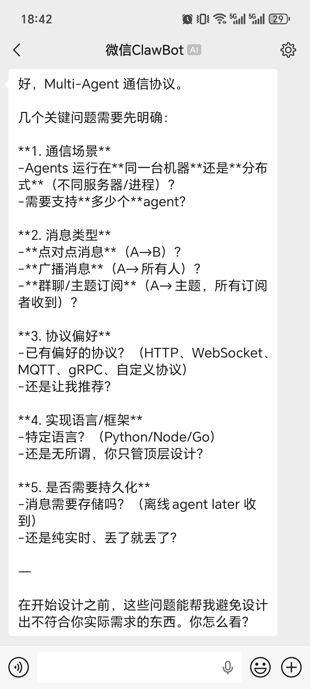

# OpenCodeWeChat

把微信变成 **OpenCode / Oh My OpenAgent (OMO)** 的移动入口。

OpenCodeWeChat 通过微信官方 **ClawBot ilink API**，在本机桥接微信消息与 `opencode serve`。你可以在微信里对话、跑 OMO 工作流、收发图片/文件/PDF，并用浏览器控制台完成扫码、启停、绑定和看日志。

**当前版本：** 0.5.0 · **运行时：** Bun · **许可证：** MIT

## 效果预览




## 适合谁

- 想在微信里随时调用本机 OpenCode / OMO
- 不想一直守着终端，希望用本机 GUI 管理扫码、启停和日志
- 需要把微信图片、视频、文件交给本地 AI 处理
- 希望 AI 生成的报告 / PDF / 图片能直接发回微信
- 需要更稳的桥接层：绑定鉴权、文本分片、消息去重、失败重试、会话过期退出

## 功能概览

| 能力 | 说明 |
|------|------|
| 微信 ↔ 本机 AI | 长轮询 ClawBot，转发到 OpenCode / OMO，完成后回微信 |
| 聊天绑定 | 六位一次性绑定码，未绑定用户不能调用本机 AI |
| 斜杠命令 | `/帮助`、`/状态`、`/项目`、`/模型`、`/模式` 等 |
| OMO 工作流 | `#plan`、`#start`、`#ulw`、`#review` 等 |
| 双向媒体 | 微信入站下载解密；AI 出站上传图片/视频/文件 |
| 图形控制台 | macOS 设置页风格 GUI（侧边栏、分组、浅色/深色） |
| 稳定性 | 游标保护、毒消息跳过、OpenCode 断线重建、session timeout 终止 |

## 工作方式

```text
微信客户端
  → ClawBot
  → ilink API（长轮询）
  → OpenCodeWeChat
  → opencode serve
  → OpenCode / OMO agent
  → 文本分片 + 媒体回传微信
```

1. `getUpdates` 长轮询拉取消息  
2. 解析斜杠命令 / OMO 指令 / 媒体  
3. 已绑定用户创建或恢复 OpenCode session  
4. 等待完成后，按安全长度分片回微信；含媒体指令则上传本地文件  
5. 不把生成中的半截内容刷到微信，只发最终结果  

## 下载使用（推荐）

普通用户可直接下载一键包，无需克隆源码。

- **最新版本：** [v0.5.0](https://github.com/zxfccmm4/OpenCodeWeChat/releases/tag/v0.5.0)
- **全部发布：** [Releases](https://github.com/zxfccmm4/OpenCodeWeChat/releases)

| 平台 | 文件 | 大小 | SHA256 |
|------|------|------|--------|
| macOS Apple Silicon | [OpenCodeWeChat-0.5.0-macos-arm64.zip](https://github.com/zxfccmm4/OpenCodeWeChat/releases/download/v0.5.0/OpenCodeWeChat-0.5.0-macos-arm64.zip) | 68 MB | `44ff5a9c6fa80a0344f4b405f009de22dc19e03283c6ecbf72405cf3c1be4188` |
| macOS Intel | [OpenCodeWeChat-0.5.0-macos-x64.zip](https://github.com/zxfccmm4/OpenCodeWeChat/releases/download/v0.5.0/OpenCodeWeChat-0.5.0-macos-x64.zip) | 76 MB | `89b3019d8e62b0bb3ddf80845668b4402a8fd8d01cd55b415b0b362a519baafb` |
| Windows x64 | [OpenCodeWeChat-0.5.0-windows-x64.zip](https://github.com/zxfccmm4/OpenCodeWeChat/releases/download/v0.5.0/OpenCodeWeChat-0.5.0-windows-x64.zip) | 110 MB | `f7ba551706e66c2252aaffafd1a34a963e97558ead28ce79787bf68ce562d9b3` |

校验：

```bash
# macOS / Linux
shasum -a 256 OpenCodeWeChat-0.5.0-*.zip

# Windows PowerShell
Get-FileHash .\OpenCodeWeChat-0.5.0-windows-x64.zip -Algorithm SHA256
```

解压后：

- macOS：双击 `OpenCodeWeChat GUI.command`
- Windows：双击 `OpenCodeWeChat GUI.bat`

macOS 若提示「已损坏，无法打开」：

```bash
xattr -dr com.apple.quarantine .
```

本地从源码重新打包：

```bash
bun run package:all
# 输出：dist/one-click/
```

### 一键包流程

**前置条件**

- 本机已安装并可运行 `opencode`
- 微信账号可使用 ClawBot
- 使用 OMO 时，本机已配置好对应 agent

**步骤**

1. 下载并解压当前平台 zip  
2. macOS 双击 `OpenCodeWeChat GUI.command`，Windows 双击 `OpenCodeWeChat GUI.bat`  
3. 浏览器打开控制台后，扫码登录微信  
4. 点击 **启动通道**  
5. 在 **聊天绑定** 生成六位码，微信向 ClawBot 发送 `/bind 123456`  
6. 绑定成功后直接描述任务，或发送 `/帮助`  

GUI 默认只监听 `127.0.0.1:5179`。端口占用时可设置：

```bash
OPENCODE_WECHAT_GUI_PORT=5180
```

## 源码运行

```bash
git clone https://github.com/zxfccmm4/OpenCodeWeChat.git
cd OpenCodeWeChat
bun install
```

```bash
# 扫码登录（首次）
bun setup.ts

# 启动通道
bun index.ts

# 启动 GUI 控制台
bun run gui

# 登出并清理登录态（收件箱保留）
bun scripts/logout.ts
```

### 启动脚本

| 用途 | macOS | Windows | Linux |
|------|-------|---------|-------|
| 菜单启动器 | `launchers/OpenCodeWeChatLauncher.command` | `launchers/OpenCodeWeChatLauncher.cmd` | `launchers/OpenCodeWeChatLauncher.sh` |
| 启动通道 | `launchers/OpenCodeWeChat.command` | `launchers/OpenCodeWeChat.cmd` | — |
| 启动 GUI | `launchers/OpenCodeWeChatGUI.command` | `launchers/OpenCodeWeChatGUI.cmd` | `launchers/OpenCodeWeChatGUI.sh` |
| 停止通道 | `launchers/StopOpenCodeWeChat.command` | `launchers/StopOpenCodeWeChat.cmd` | — |

## 图形控制台

`bun run gui` 或一键包 GUI 启动器会打开本机控制台。

**界面（macOS 设置页风格）**

- 侧边栏：通用 / 聊天绑定 / Sessions / 日志  
- 侧边栏搜索、外观（自动 / 浅色 / 深色，跟随系统）  
- 扫码登录、启停通道、生成绑定码  
- OpenCode Session 列表与历史、完成通知  
- 实时读取 `channel.log`  

**安全**

- 仅绑定 `127.0.0.1`  
- 管理令牌每次启动随机生成  
- API 校验本机 Host / Origin 与管理令牌  

## 聊天绑定

为防止任意微信联系人调用本机 AI，普通对话与特权命令需要先绑定。

1. 微信已登录，通道正在运行  
2. GUI → **聊天绑定** → **生成绑定码**  
3. 微信发送（六位数字，约 10 分钟有效）：

```text
/bind 123456
```

4. 绑定成功后会收到激活说明  

- 生成新码会使旧码失效  
- 控制台仅显示脱敏标识（如 `••••1234`），可解除绑定  
- 未绑定用户发普通消息时，会收到引导，**不会**调用 OpenCode  
- 首次联系会自动发送欢迎与命令说明（每人一次）  

## 机器人命令

在微信发送（中英文别名均可）。除 `/帮助`、`/bind` 外，均需先绑定。

| 命令 | 别名 | 说明 |
|------|------|------|
| `/帮助` | `/help` | 命令说明（无需绑定） |
| `/bind 六位码` | `/绑定` | 绑定当前聊天（无需绑定） |
| `/状态` | `/status` | 工作区、Session、模型、模式、思考、回复 |
| `/新建` | `/new`、`/clear` | 新任务草稿（保留偏好，清除最近 `#plan`） |
| `/项目` | `/project` | 列出或切换工作区 |
| `/模型` | `/model` | 列出或切换模型 |
| `/模式` | `/mode` | 列出或切换 agent |
| `/思考` | `/thinking` | 列出或切换思考级别 |
| `/回复` | `/reply` | 简洁 / 标准 / 详细 |

```text
/帮助
/bind 012345
/状态
/模型 openai/gpt-5
/模式 sisyphus
/回复 简洁
/新建
帮我检查这个仓库的启动脚本
```

说明：

- 斜杠命令不能附带图片、语音、视频或文件  
- 不带参数的 `/项目`、`/模型`、`/模式`、`/思考`、`/回复` 会返回列表，再用编号或名称切换  

## OMO 指令

普通消息默认尽量路由到 OMO 主 agent（优先 `omo` / `sisyphus`）。也可在消息开头加：

| 指令 | 用途 |
|------|------|
| `#plan` | 先规划任务 |
| `#start` | 沿最近 `#plan` 继续 |
| `#ulw` / `#ultrawork` | 尽量自主推进到可验证结果 |
| `#team` | 多成员协作 |
| `#hyperplan` | 结构化复杂规划 |
| `#ulw-loop` / `#loop` | 循环推进与验证 |
| `#search` / `#explore` | 检索、探索 |
| `#analyze` / `#metis` | 根因分析 |
| `#delegate` | 分工委派 |
| `#deep` | 深度分析 |
| `#review` | 代码评审 |
| `#summary` | 压缩总结 |

```text
#plan 帮我把这个发布流程拆成可执行步骤
#start 按刚才的计划继续做第一步
#review 帮我检查这次改动有没有回归风险
#ulw 修复这个 bug，验证通过后告诉我结果
```

`#plan` 结果按微信用户缓存在本机，后续 `#start` 会自动带上。

## 文件和媒体

### 微信 → AI

图片、视频、文件（及未转写语音）会下载解密到：

```text
~/.claude/channels/wechat/inbox/
```

OpenCode / OMO 收到本地路径后可继续处理。

### AI → 微信

让模型在最终回复中输出媒体指令：

```text
[[wechat-image:/absolute/path/result.png|可选说明]]
[[wechat-video:/absolute/path/demo.mp4|可选说明]]
[[wechat-file:/absolute/path/report.pdf|可选说明]]
```

- 路径必须是运行本桥接的机器上的真实绝对路径  
- 兼容 `~`、全角冒号、反引号/引号包裹  
- 上传失败会回失败原因文本，不堵队列  
- PDF / 报告等长任务默认等待 **300 秒**  

## 配置

| 变量 | 默认 | 说明 |
|------|------|------|
| `HOME` / `USERPROFILE` | 用户目录 | 状态文件根目录 |
| `OPENCODE_BIN` | `opencode` | OpenCode CLI 路径 |
| `OPENCODE_AGENT` | 自动 | 默认 agent；`omo` / `sisyphus` 走 OMO 路由 |
| `OPENCODE_PROVIDER_ID` | 空 | 一般不要设 |
| `OPENCODE_MODEL_ID` | 空 | 一般不要设 |
| `OPENCODE_SERVER_USERNAME` | `opencode` | 本地 server 用户名 |
| `OPENCODE_SERVER_PASSWORD` | 自动生成 | 本地 server 密码 |
| `OPENCODE_WECHAT_GUI_PORT` | `5179` | GUI 端口 |
| `OPENCODE_WECHAT_CDN_BASE_URL` | 微信 CDN | 媒体 CDN |
| `OPENCODE_WECHAT_INBOX_DIR` | `~/.claude/channels/wechat/inbox` | 收件箱 |
| `OPENCODE_WECHAT_STREAM_CAPTURE` | `1` | SSE 完整性兜底 |
| `OPENCODE_WECHAT_TYPING` | `0` | 微信「正在输入」 |
| `OPENCODE_WECHAT_TYPING_MAX_MS` | `45000` | 输入状态最长保持 |
| `OPENCODE_WECHAT_PROMPT_TIMEOUT_MS` | `60000` | 普通任务超时 |
| `OPENCODE_WECHAT_LONG_PROMPT_TIMEOUT_MS` | `300000` | 文件/PDF/报告超时 |
| `OPENCODE_WECHAT_TEXT_CHUNK_CHARS` | `500` | 文本分片长度 |
| `OPENCODE_WECHAT_VERBOSE_LOGS` | `0` | 详细消息日志 |

模型建议：不要设置 `OPENCODE_PROVIDER_ID` / `OPENCODE_MODEL_ID`，交给本机 OpenCode / OMO 默认配置。若出现 `ProviderModelNotFoundError`，优先清空这两个变量。

## 本地状态

```text
~/.claude/channels/wechat/
```

| 文件 | 说明 |
|------|------|
| `account.json` | 微信登录凭据 |
| `bot_state.sqlite` | 绑定与会话偏好 |
| `sync_buf.txt` | 同步游标 |
| `context_tokens.json` | `context_token` 缓存 |
| `processed_messages.json` | 消息去重 |
| `omo_plan_context.json` | 各用户最近 `#plan` |
| `welcomed_senders.json` | 已发首次欢迎的用户 |
| `opencode-wechat.pid` | 通道 PID |
| `channel.log` | 通道日志（约 5MB 轮转） |
| `inbox/` | 入站媒体 |

## 常见问题

### macOS 提示应用已损坏

```bash
xattr -dr com.apple.quarantine .
```

### 找不到 OpenCode

```bash
opencode --version
# 若不在 PATH：
export OPENCODE_BIN=/absolute/path/to/opencode
```

### `errcode=-14` / session timeout

微信登录会话已过期。通道会终止并清理失效 `account.json`。请在 GUI **重新扫码登录**，再启动通道。

### 回复被截断

- 确认 `OPENCODE_WECHAT_STREAM_CAPTURE` 未设为 `0`  
- 分片长度不要过大，默认 `500` 更稳  
- 查看 `channel.log` 是否有超时或 Provider 错误  

### PDF / 长报告超时

```bash
export OPENCODE_WECHAT_LONG_PROMPT_TIMEOUT_MS=600000
```

并要求模型真正生成文件后输出：

```text
[[wechat-file:/absolute/path/report.pdf|报告]]
```

### 消息连续失败被跳过

同一条消息失败 3 次会跳过并通知原因，避免堵死队列。修好环境后重新发送即可。

## 开发

```bash
bun test
bun run typecheck
bun run package:current
bun run package:all
```

打包：

```bash
bun scripts/package-app.ts --target macos-arm64 --target macos-x64 --target windows-x64
```

输出：`dist/one-click/`

### 项目结构

```text
api/          微信 ilink、媒体上传/下载
core/         斜杠命令、OMO 指令、分片、媒体指令
gui/          浏览器控制台（设置页风格）
login/        扫码登录
opencode/     serve、session、SSE、agent、发现
polling/      长轮询、消息处理、回复、重试
storage/      凭据、绑定、状态库、日志
scripts/      打包、登出
launchers/    跨平台启动器
tests/        Bun 自动化测试
docs/         部署与发布说明
```

更多文档：

- [部署文档](docs/DEPLOYMENT.md)
- [v0.5.0 发布说明](docs/RELEASE-v0.5.0.md)
- [v0.4.0 发布说明](docs/RELEASE-v0.4.0.md)

## 许可证

MIT
