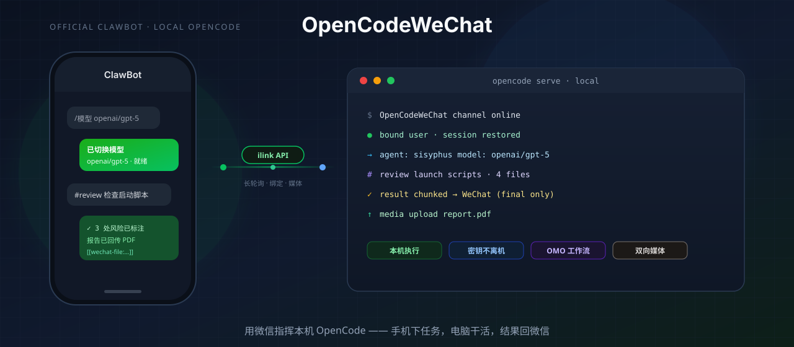
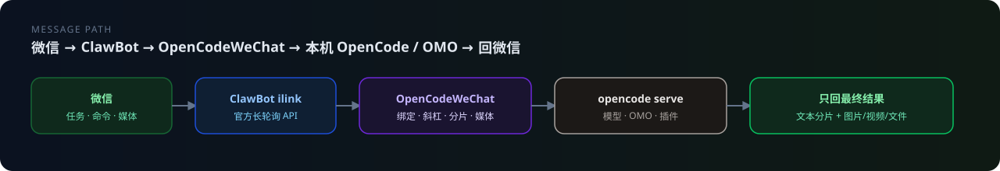
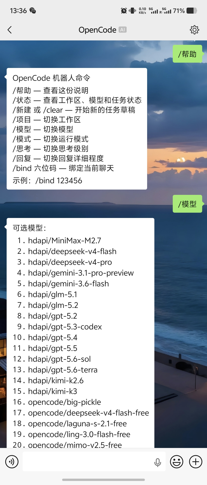
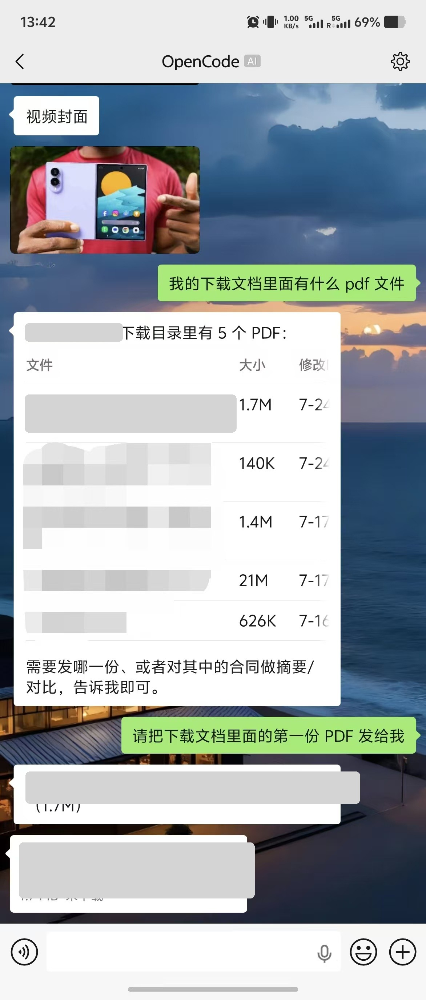
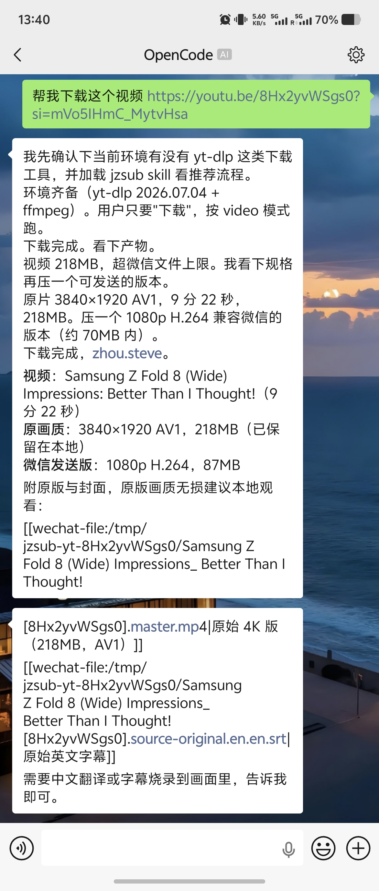
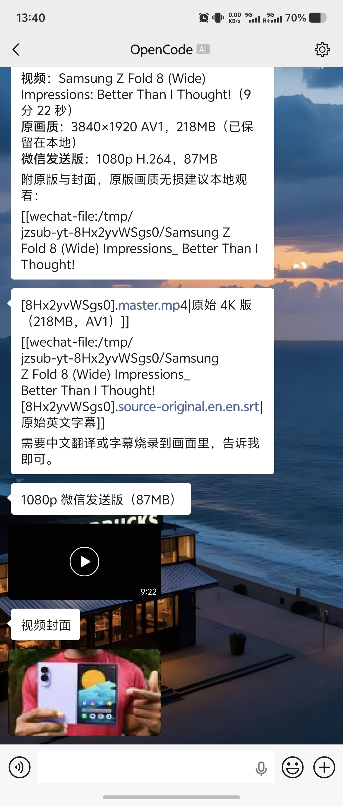
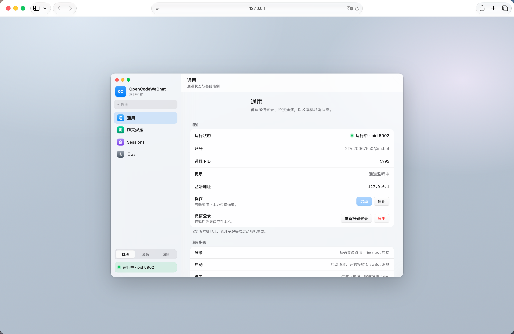
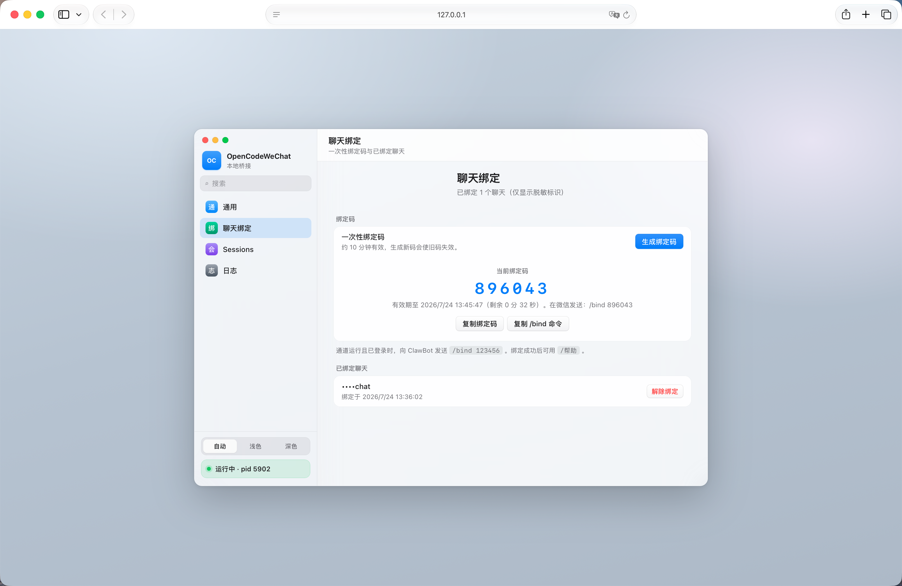
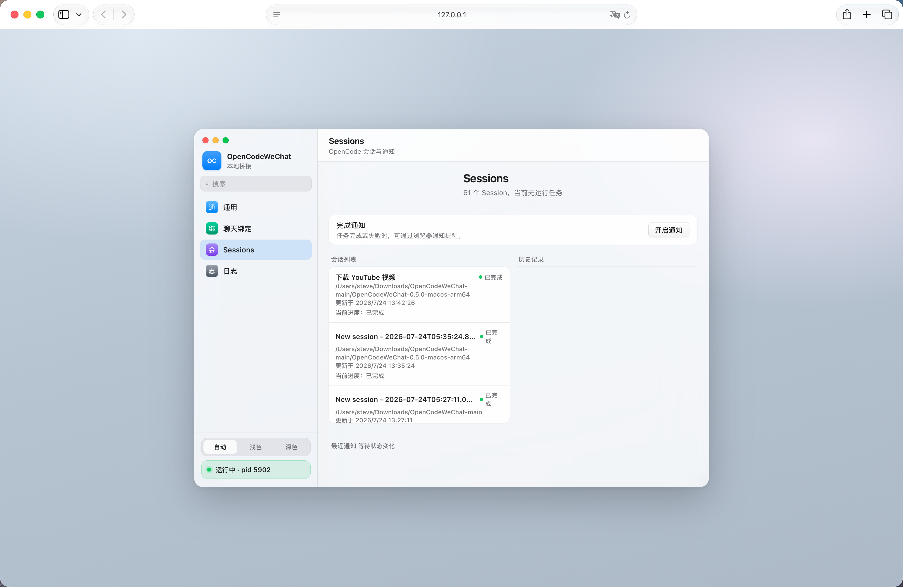
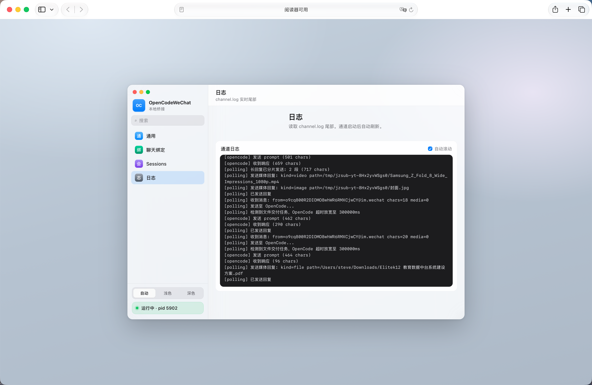

<p align="center">
  
</p>

<p align="center">
  <strong>用微信 ClawBot 管理本机 OpenCode——在手机里指挥它干活。</strong><br>
  <sub>代码、仓库、密钥留在本机 · 入口在口袋里</sub>
</p>

<p align="center">
  <a href="https://github.com/zxfccmm4/OpenCodeWeChat/releases"></a>
  <a href="https://bun.sh"></a>
  <a href="https://opensource.org/licenses/MIT"></a>
  <a href="https://github.com/zxfccmm4/OpenCodeWeChat/releases"></a>
</p>

本地 OpenCode 很强，但人必须守在电脑前。  
**OpenCodeWeChat** 通过微信官方 **ClawBot ilink API**，把手机接到本机 `opencode serve`：

| 你在手机上做 | 本机自动做 | 回到微信 |
|:---|:---|:---|
| 下任务、切模型、跑 **OMO** 工作流 | 用已配置的全部模型与插件执行 | 只回**最终结果**（可含文件/视频） |
| `/bind` 绑定聊天 | 未绑定**不会**调用本机 AI | 绑定码约 10 分钟有效 |
| 发图片 / PDF / 视频 | 解密到本地 inbox，交给 OpenCode | 支持 `[[wechat-file:…]]` 等回传 |
| 浏览器控制台扫码、启停、看日志 | 通道长轮询、分片、媒体上传 | GUI 仅 `127.0.0.1` |

<p align="center">
  
</p>

## 目录

- [效果预览](#效果预览)
- [5 分钟上手](#5-分钟上手推荐)
- [功能一览](#功能一览)
- [工作方式](#工作方式)
- [源码运行](#源码运行)
- [聊天绑定](#聊天绑定)
- [命令与 OMO](#命令与-omo)
- [文件与媒体](#文件与媒体)
- [配置](#配置)
- [常见问题](#常见问题)
- [开发](#开发)

---

## 效果预览

手机指挥 OpenCode，本机执行，结果回微信：

| 斜杠命令 · 切模型 | PDF 列表与文件回传 |
|:---:|:---:|
|  |  |

| 本机下载 / 处理视频 | 视频与封面回传微信 |
|:---:|:---:|
|  |  |

本机 GUI（仅 `127.0.0.1`）：

| 通道状态 | 聊天绑定 | Sessions | 实时日志 |
|:---:|:---:|:---:|:---:|
|  |  |  |  |

---

<p align="center">
  
</p>

## 5 分钟上手（推荐）

普通用户下载一键包即可，无需克隆源码。

### 前置

| 条件 | 说明 |
|------|------|
| OpenCode | 本机已安装并可运行 `opencode` |
| ClawBot | 微信账号可使用官方 ClawBot |
| OMO（可选） | 需要工作流时，本机已配置对应 agent |

### 下载

| 平台 | 包 | 大小 | SHA256 |
|------|-----|------|--------|
| macOS Apple Silicon | [macos-arm64](https://github.com/zxfccmm4/OpenCodeWeChat/releases/download/v0.5.0/OpenCodeWeChat-0.5.0-macos-arm64.zip) | 68 MB | `13579140b5d8f5236298a29b68c2bfd73e6dbd5b870fa60e8d3d8a5411674e3c` |
| macOS Intel | [macos-x64](https://github.com/zxfccmm4/OpenCodeWeChat/releases/download/v0.5.0/OpenCodeWeChat-0.5.0-macos-x64.zip) | 76 MB | `3493ed35ddf0a71122c3d583af51d6b13df21d9de41e9032411f5470783513e6` |
| Windows x64 | [windows-x64](https://github.com/zxfccmm4/OpenCodeWeChat/releases/download/v0.5.0/OpenCodeWeChat-0.5.0-windows-x64.zip) | 110 MB | `2f243aec5daf9bc144cb7dd745f6a82b1e2acc3e6dce93e0463dc5a3f4301c40` |
| Linux x64 | [linux-x64](https://github.com/zxfccmm4/OpenCodeWeChat/releases/download/v0.5.0/OpenCodeWeChat-0.5.0-linux-x64.zip) | 103 MB | `ed4319b996201369b88347a9fb16cc6324cdd828dc1c97ccef85477720f69b95` |
| Linux arm64 | [linux-arm64](https://github.com/zxfccmm4/OpenCodeWeChat/releases/download/v0.5.0/OpenCodeWeChat-0.5.0-linux-arm64.zip) | 102 MB | `e86c44beb8da53e58cb78b8e863f42c06b859599e25ee77ded6f2db9661eefd4` |

更多版本与校验文件见 [Releases](https://github.com/zxfccmm4/OpenCodeWeChat/releases)。

```bash
# macOS / Linux
shasum -a 256 OpenCodeWeChat-0.5.0-*.zip

# Windows PowerShell
Get-FileHash .\OpenCodeWeChat-0.5.0-windows-x64.zip -Algorithm SHA256
```

### 启动

1. 解压 zip  
2. **macOS** 双击 `OpenCodeWeChat GUI.command` · **Windows** 双击 `OpenCodeWeChat GUI.bat`  
3. 浏览器打开控制台 → **扫码登录微信**  
4. 点击 **启动通道**  
5. **聊天绑定** → 生成六位码 → 微信向 ClawBot 发送：

```text
/bind 123456
```

6. 绑定成功后直接描述任务，或发送 `/帮助`

> macOS 若提示「已损坏，无法打开」：在解压目录执行  
> `xattr -dr com.apple.quarantine .`

GUI 默认只监听 `127.0.0.1:5179`。端口占用时：

```bash
export OPENCODE_WECHAT_GUI_PORT=5180
```

---

<p align="center">
  
</p>

## 功能一览

| 能力 | 说明 |
|------|------|
| 手机指挥 OpenCode | ClawBot 长轮询 → 本机 OpenCode / OMO → 结果回微信 |
| 模型与 OMO 无缝 | 沿用本机已配置模型；`#plan` / `#ulw` / `#review` 等 |
| 聊天绑定 | 六位一次性码；未绑定**不会**调用本机 AI |
| 斜杠命令 | `/帮助` `/状态` `/项目` `/模型` `/模式` `/思考` `/回复` … |
| 双向媒体 | 微信入站下载解密；AI 出站回传图片 / 视频 / 文件 |
| 图形控制台 | 设置页风格 GUI：扫码、启停、绑定、Sessions、日志 |
| 稳定性 | 游标保护、毒消息跳过、断线重建、session 过期退出 |

**适合：** 想在微信里用本机 OpenCode / OMO，又不愿一直守着终端的人。

---

## 工作方式

```text
微信客户端
  → ClawBot
  → ilink API（长轮询 getUpdates）
  → OpenCodeWeChat（绑定 · 命令 · 媒体）
  → opencode serve
  → OpenCode / OMO agent
  → 文本分片 + 媒体回传 → 你的手机
```

1. 长轮询拉取消息  
2. 解析斜杠命令 / OMO 指令 / 媒体  
3. 已绑定用户创建或恢复 OpenCode session  
4. 完成后按安全长度分片回微信；含媒体指令则上传本地文件  
5. **只发最终结果**，不把生成中的半截内容刷到微信  

---

## 源码运行

```bash
git clone https://github.com/zxfccmm4/OpenCodeWeChat.git
cd OpenCodeWeChat
bun install

bun setup.ts          # 首次扫码登录
bun index.ts          # 启动通道
bun run gui           # 图形控制台
bun scripts/logout.ts # 登出（收件箱保留）
```

| 用途 | macOS | Windows | Linux |
|------|-------|---------|-------|
| 菜单启动器 | `launchers/OpenCodeWeChatLauncher.command` | `…Launcher.cmd` | `…Launcher.sh` |
| 启动通道 | `launchers/OpenCodeWeChat.command` | `…WeChat.cmd` | — |
| 启动 GUI | `launchers/OpenCodeWeChatGUI.command` | `…GUI.cmd` | `…GUI.sh` |
| 停止通道 | `launchers/StopOpenCodeWeChat.command` | `…Stop….cmd` | — |

从源码打包：

```bash
bun run package:all    # → dist/one-click/
```

### 图形控制台

- 侧边栏：通用 / 聊天绑定 / Sessions / 日志  
- 外观：自动 / 浅色 / 深色  
- 扫码登录、启停通道、生成绑定码、Session 历史与完成通知  
- 实时尾读 `channel.log`  

**安全：** 仅绑定 `127.0.0.1`；管理令牌每次启动随机生成；API 校验本机 Host / Origin 与令牌。

---

## 聊天绑定

防止任意微信联系人调用本机 AI。除 `/帮助`、`/bind` 外，均需先绑定。

1. 微信已登录，通道运行中  
2. GUI → **聊天绑定** → **生成绑定码**  
3. 微信发送（约 10 分钟有效）：

```text
/bind 123456
```

- 新码会使旧码失效  
- 控制台仅显示脱敏标识（如 `••••1234`），可解除绑定  
- 未绑定用户发普通消息会收到引导，**不会**调用 OpenCode  
- 首次联系自动发送欢迎与命令说明（每人一次）  

---

<p align="center">
  
</p>

## 命令与 OMO

### 斜杠命令

中英文别名均可。除 `/帮助`、`/bind` 外需绑定。

| 命令 | 别名 | 说明 |
|------|------|------|
| `/帮助` | `/help` | 命令说明 |
| `/bind 六位码` | `/绑定` | 绑定当前聊天 |
| `/状态` | `/status` | 工作区、Session、模型、模式、思考、回复 |
| `/新建` | `/new`、`/clear` | 新任务草稿（保留偏好，清除最近 `#plan`） |
| `/项目` | `/project` | 列出或切换工作区 |
| `/模型` | `/model` | 列出或切换模型 |
| `/模式` | `/mode` | 列出或切换 agent |
| `/思考` | `/thinking` | 列出或切换思考级别 |
| `/回复` | `/reply` | 简洁 / 标准 / 详细 |

```text
/帮助
/bind 012345
/状态
/模型 openai/gpt-5
/模式 sisyphus
/回复 简洁
/新建
帮我检查这个仓库的启动脚本
```

- 斜杠命令不能附带图片、语音、视频或文件  
- 不带参数的 `/项目`、`/模型`、`/模式`、`/思考`、`/回复` 会返回列表，再用编号或名称切换  

### OMO 指令

普通消息默认尽量路由到 OMO 主 agent（优先 `omo` / `sisyphus`）。也可在消息开头加：

| 指令 | 用途 |
|------|------|
| `#plan` | 先规划任务 |
| `#start` | 沿最近 `#plan` 继续 |
| `#ulw` / `#ultrawork` | 尽量自主推进到可验证结果 |
| `#team` | 多成员协作 |
| `#hyperplan` | 结构化复杂规划 |
| `#ulw-loop` / `#loop` | 循环推进与验证 |
| `#search` / `#explore` | 检索、探索 |
| `#analyze` / `#metis` | 根因分析 |
| `#delegate` | 分工委派 |
| `#deep` | 深度分析 |
| `#review` | 代码评审 |
| `#summary` | 压缩总结 |

```text
#plan 帮我把这个发布流程拆成可执行步骤
#start 按刚才的计划继续做第一步
#review 帮我检查这次改动有没有回归风险
#ulw 修复这个 bug，验证通过后告诉我结果
```

`#plan` 结果按微信用户缓存在本机，后续 `#start` 会自动带上。

---

## 文件与媒体

### 微信 → AI

图片、视频、文件（及未转写语音）下载解密到：

```text
~/.claude/channels/wechat/inbox/
```

OpenCode / OMO 收到本地路径后可继续处理。

### AI → 微信

让模型在最终回复中输出：

```text
[[wechat-image:/absolute/path/result.png|可选说明]]
[[wechat-video:/absolute/path/demo.mp4|可选说明]]
[[wechat-file:/absolute/path/report.pdf|可选说明]]
```

- 路径须为本机真实绝对路径（兼容 `~`、全角冒号、引号包裹）  
- 上传失败会回文本原因，不堵队列  
- PDF / 报告等长任务默认等待 **300 秒**  

---

## 配置

| 变量 | 默认 | 说明 |
|------|------|------|
| `OPENCODE_BIN` | `opencode` | OpenCode CLI 路径 |
| `OPENCODE_AGENT` | 自动 | 默认 agent；`omo` / `sisyphus` 走 OMO 路由 |
| `OPENCODE_PROVIDER_ID` | 空 | **一般不要设** |
| `OPENCODE_MODEL_ID` | 空 | **一般不要设** |
| `OPENCODE_WECHAT_GUI_PORT` | `5179` | GUI 端口 |
| `OPENCODE_WECHAT_INBOX_DIR` | `~/.claude/channels/wechat/inbox` | 收件箱 |
| `OPENCODE_WECHAT_STREAM_CAPTURE` | `1` | SSE 完整性兜底 |
| `OPENCODE_WECHAT_PROMPT_TIMEOUT_MS` | `60000` | 普通任务超时 |
| `OPENCODE_WECHAT_LONG_PROMPT_TIMEOUT_MS` | `300000` | 文件 / PDF / 报告超时 |
| `OPENCODE_WECHAT_TEXT_CHUNK_CHARS` | `500` | 文本分片长度 |
| `OPENCODE_WECHAT_TYPING` | `0` | 微信「正在输入」 |
| `OPENCODE_WECHAT_TYPING_MAX_MS` | `45000` | 输入状态最长保持 |
| `OPENCODE_WECHAT_VERBOSE_LOGS` | `0` | 详细消息日志 |
| `OPENCODE_WECHAT_CDN_BASE_URL` | 微信 CDN | 媒体 CDN |
| `OPENCODE_SERVER_USERNAME` | `opencode` | 本地 server 用户名 |
| `OPENCODE_SERVER_PASSWORD` | 自动生成 | 本地 server 密码 |

> 模型交给本机 OpenCode / OMO 默认配置。若出现 `ProviderModelNotFoundError`，优先清空 `OPENCODE_PROVIDER_ID` / `OPENCODE_MODEL_ID`。

### 本地状态

```text
~/.claude/channels/wechat/
```

| 文件 | 说明 |
|------|------|
| `account.json` | 微信登录凭据 |
| `bot_state.sqlite` | 绑定与会话偏好 |
| `sync_buf.txt` | 同步游标 |
| `context_tokens.json` | `context_token` 缓存 |
| `processed_messages.json` | 消息去重 |
| `omo_plan_context.json` | 各用户最近 `#plan` |
| `welcomed_senders.json` | 已发首次欢迎的用户 |
| `opencode-wechat.pid` | 通道 PID |
| `channel.log` | 通道日志（约 5MB 轮转） |
| `inbox/` | 入站媒体 |

---

## 常见问题

**macOS 提示应用已损坏**

```bash
xattr -dr com.apple.quarantine .
```

**找不到 OpenCode**

```bash
opencode --version
export OPENCODE_BIN=/absolute/path/to/opencode   # 若不在 PATH
```

**`errcode=-14` / session timeout**  
微信登录已过期。通道会清理失效 `account.json`。请在 GUI **重新扫码登录**，再启动通道。

**回复被截断**  
确认 `OPENCODE_WECHAT_STREAM_CAPTURE` 未设为 `0`；分片保持默认 `500` 更稳；查看 `channel.log`。

**PDF / 长报告超时**

```bash
export OPENCODE_WECHAT_LONG_PROMPT_TIMEOUT_MS=600000
```

并要求模型生成文件后输出：

```text
[[wechat-file:/absolute/path/report.pdf|报告]]
```

**消息连续失败被跳过**  
同一条消息失败 3 次会跳过并通知原因，避免堵死队列。修好环境后重新发送即可。

---

## 开发

```bash
bun test
bun run typecheck
bun run package:current
bun run package:all
```

```bash
bun scripts/package-app.ts --target macos-arm64 --target macos-x64 --target windows-x64
# 输出：dist/one-click/
```

```text
api/          微信 ilink、媒体上传/下载
core/         斜杠命令、OMO 指令、分片、媒体指令
gui/          浏览器控制台
login/        扫码登录
opencode/     serve、session、SSE、agent
polling/      长轮询、消息处理、回复、重试
storage/      凭据、绑定、状态库、日志
scripts/      打包、登出
launchers/    跨平台启动器
tests/        自动化测试
docs/         故事页、部署与发布说明
```

### 更多文档

- [部署文档](docs/DEPLOYMENT.md)  
- [v0.5.0 发布说明](docs/RELEASE-v0.5.0.md) · [v0.4.0](docs/RELEASE-v0.4.0.md)  

---

## 许可证

[MIT](https://opensource.org/licenses/MIT) © 贡献者
