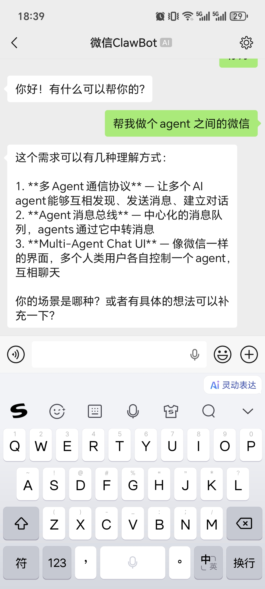

# OpenCodeWeChat

通过微信官方 ClawBot ilink API，将微信消息桥接到 Claude Code 会话，让你直接在微信里与 Claude 对话。

## 效果预览




## 工作原理

```
┌──────────┐    ┌──────────────┐   ┌────────────┐   ┌─────────────────┐
│ 微信客户端 │──▶│ WeChat       │──▶│  ilink API │──▶│ OpenCodeWeChat  │
│          │    │ ClawBot      │   │            │   │                 │
└──────────┘    └──────────────┘   └────────────┘   └────────┬────────┘
                                                              │
                                                              ▼
                                                  ┌─────────────────────┐
                                                  │  OpenCode SDK       │
                                                  │                     │
                                                  │  Session.prompt()   │
                                                  │  直接调用 AI 模型    │
                                                  └─────────────────────┘
```

1. **接收消息** — 通过 `ilink/bot/getupdates` 长轮询获取微信用户消息
2. **转发消息** — 通过 OpenCode SDK 的 `Session.prompt()` 直接调用 AI 模型
3. **发送回复** — AI 响应通过 `ilink/bot/sendmessage` 发回微信

## 前置要求

- [Bun](https://bun.sh) >= 1.0
- [Claude Code](https://claude.com/claude-code) >= 2.1.80
- claude.ai 账号登录（不支持 API Key）
- 微信 iOS 或 Android 最新版（需支持 ClawBot 插件）

## 快速开始

### 1. 安装

```bash
git clone <repo-url>
cd OpenCodeWeChat
bun install
```

### 2. 微信扫码登录

```bash
bun setup.ts
```

终端会显示二维码，用微信扫描并在 ClawBot 中确认。凭据保存到 `~/.claude/channels/wechat/account.json`。

如果终端二维码显示不完整，可以用以下方式获取链接：

```bash
bun -e "import {fetchQRCode} from './api/ilink.ts'; const q = await fetchQRCode('https://ilinkai.weixin.qq.com'); console.log(q.qrcode_img_content);"
```

### 3. 启动通道

```bash
bun index.ts
```

### 4. 开始对话

在微信中找到 ClawBot 对话，发送消息。Claude Code 终端会收到消息并自动回复。

## 项目结构

```
OpenCodeWeChat/
├── api/
│   └── ilink.ts               # ilink API 客户端
├── core/
│   ├── message.ts             # 消息解析、文本提取、引用消息
│   └── context-token.ts       # Context token 缓存
├── login/
│   └── qr.ts                  # QR 码登录流程
├── opencode/
│   └── client.ts              # OpenCode SDK 封装
├── polling/
│   └── loop.ts                # 长轮询消息循环
├── storage/
│   ├── credentials.ts         # 凭据加载/保存
│   └── sync-buffer.ts         # Sync buffer 持久化
├── types/
│   └── wechat.ts              # TypeScript 类型定义
├── config.ts                  # 配置常量
├── index.ts                   # 入口
├── setup.ts                   # 独立扫码登录工具
├── tsconfig.json
├── package.json
└── README.md
```

## 技术实现

### ilink API

ilink 是微信官方的 ClawBot 通信协议，基于 HTTPS REST API。主要端点：

| 端点 | 用途 |
|------|------|
| `GET ilink/bot/get_bot_qrcode` | 获取登录二维码 |
| `GET ilink/bot/get_qrcode_status` | 轮询扫码状态 |
| `POST ilink/bot/getupdates` | 长轮询获取新消息 |
| `POST ilink/bot/sendmessage` | 发送消息 |

### 长轮询机制

`getupdates` 采用 35 秒长轮询，服务端 hold 住请求直到有新消息或超时。超时后立即发起下一次轮询，实现近乎实时的消息推送。

连续失败时会触发指数退避重试（最多等待 30 秒），避免对服务端造成压力。

### Sync Buffer

微信消息通过 `get_updates_buf` 实现幂等同步。每次 getupdates 返回的 buffer 会持久化到本地，重启后可从断点继续，不会漏消息也不会重复推送。

### OpenCode SDK

插件直接使用 `@opencode-ai/sdk` 与 OpenCode 通信：

- **会话管理**：`client.session.create()` — 创建新会话
- **发送 prompt**：`session.prompt()` — 发送消息并获取 AI 响应
- **认证**：`OPENCODE_SERVER_PASSWORD` 环境变量 + HTTP Basic Auth

### Context Token

微信消息需要 `context_token` 才能回复。插件在收到消息时自动缓存对应用户的 token，发送消息时取出使用。

## 常用命令

```bash
bun setup.ts    # 扫码登录（或重新登录）
bun index.ts    # 启动通道（已有凭据时直接启动）
```

## 部署

部署到 macOS launchd、Linux systemd 或从源码包安装时，参考 [DEPLOYMENT.md](DEPLOYMENT.md)。

GitHub Release 中的 `opencode-wechat-0.2.0.tar.gz` 是完整源码包，包含 README、部署文档、TypeScript 源码、`bun.lock` 和效果预览截图资源。下载后可用以下方式校验：

```bash
shasum -a 256 opencode-wechat-0.2.0.tar.gz
```

## 配置

| 环境变量 | 默认值 | 说明 |
|----------|--------|------|
| `HOME` | 系统默认值 | 凭据保存目录前缀 |
| `OPENCODE_PROVIDER_ID` | 未设置 | 可选，指定 OpenCode provider；不设置时使用 OpenCode 默认模型 |
| `OPENCODE_MODEL_ID` | 未设置 | 可选，指定 OpenCode model；必须和 `OPENCODE_PROVIDER_ID` 同时设置 |
| `OPENCODE_AGENT` | 未设置 | 可选，指定 OpenCode agent；例如 `omo` 或 `sisyphus` 使用 OMO 主 agent |

凭据文件路径：`~/.claude/channels/wechat/account.json`

例如固定使用 GitHub Copilot 的默认 Claude Sonnet：

```bash
OPENCODE_PROVIDER_ID=github-copilot OPENCODE_MODEL_ID=claude-sonnet-4.6 bun index.ts
```

使用 OMO / oh-my-openagent：

```bash
OPENCODE_AGENT=omo bun index.ts
```

`omo` / `sisyphus` 会自动映射为 OpenCode 注册的 `Sisyphus - Ultraworker` agent。通常不要同时设置 `OPENCODE_PROVIDER_ID` / `OPENCODE_MODEL_ID`，让 OMO 按自己的 agent 配置选择模型。

## 注意事项

- 使用 `OPENCODE_SERVER_PASSWORD` 环境变量进行认证（OpenCode 桌面应用已设置）
- 每次启动只能连接一个 ClawBot 实例
- 微信 ClawBot 支持 iOS 和 Android 最新版
- OpenCode 会话关闭后通道也会断开

## License

MIT
